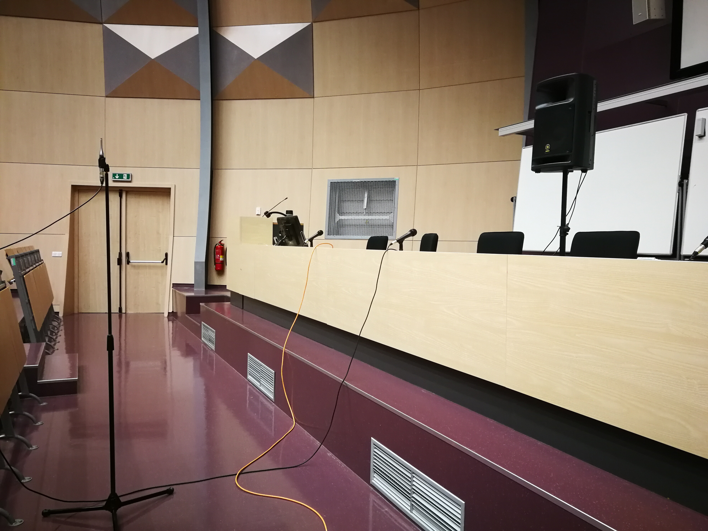

# Control Measurement

We conducted a series of measurements in the university auditorium to compare the STIPA implementation in this repository with a licensed commercial [NTi Audio XL2](https://www.nti-audio.com/en/products/sound-level-meters/xl2-audio-acoustic-analyzer) device.

## Measurement methodology

To initiate the measurements, a STIPA test signal sampled at 48 kHz was generated using the [`generateStipaSignal`](https://github.com/zawi01/stipa/blob/master/generateStipaSignal.m) function and loaded into the NTi Audio XL2 device, which was responsible for replaying the signal during the entire measurement process.

Then, a Yamaha MSR400 loudspeaker was positioned at the typical location of the teacher, and its volume was adjusted to achieve a sound level of 60&nbsp;dBA at a distance of 1 meter from the loudspeaker.

For capturing the broadcasted STIPA signal, a calibrated NTi Audio M4260 microphone was employed. The microphone was strategically placed at various positions corresponding to the typical listener's location within the auditorium. The captured signal was then routed to another NTi Audio XL2 device, which measured both the sound pressure level in dBA and the Speech Transmission Index (STI). Simultaneously, the signal was recorded using Steinberg Wavelab v9.5 DAW.

Subsequently, the recorded audio files were imported into MATLAB, stripped from the initial and ending sections of silence, and the STI values were computed using the [`stipa`](https://github.com/zawi01/stipa/blob/master/stipa.m) function.

An example setup of loudspeaker and microphone placement can be seen in the following image.

## Components

- STIPA analyzer: NTi Audio XL2 Sound Level Meter & Acoustic Analyzer, firmware v4.88 (IEC 60268-16, edition 5, 2020)
- Microphone: NTi Audio M4260
- Calibrator: B&K Type 4231
- Sound Source: Yamaha MSR400 Powered Speaker
- Audio Interface: MOTU Audio Express
- Recorder: Steinberg Wavelab v9.5, PCM @ 44.1 kHz, 32-bit float

## Results

STI results from the NTi XL2 analyzer and computed STI values using the [`stipa`](https://github.com/zawi01/stipa/blob/master/stipa.m) function are along with the measured loudness level listed in the following table.

| Level (dBA) | STI (NTi XL2) | STI (computed) |
|:-----------:|:-------------:|:--------------:|
|    61.2     |     0.73      |      0.73      |
|    60.7     |     0.65      |      0.65      |
|    59.4     |     0.51      |      0.50      |
|    60.6     |     0.59      |      0.59      |
|    60.3     |     0.53      |      0.53      |
|    62.4     |     0.72      |      0.72      |
|    62.4     |     0.69      |      0.70      |
|    59.2     |     0.49      |      0.50      |
|    59.2     |     0.50      |      0.51      |
|    64.5     |     0.76      |      0.75      |
|    65.6     |     0.52      |      0.52      |
|    63.0     |     0.43      |      0.43      |

The Mean Absolute Difference (MAD) of STI values computed by NTi XL2 and this MATLAB implementation is 0.0033.

---
Pavel Záviška, Brno University of Technology, 2023
